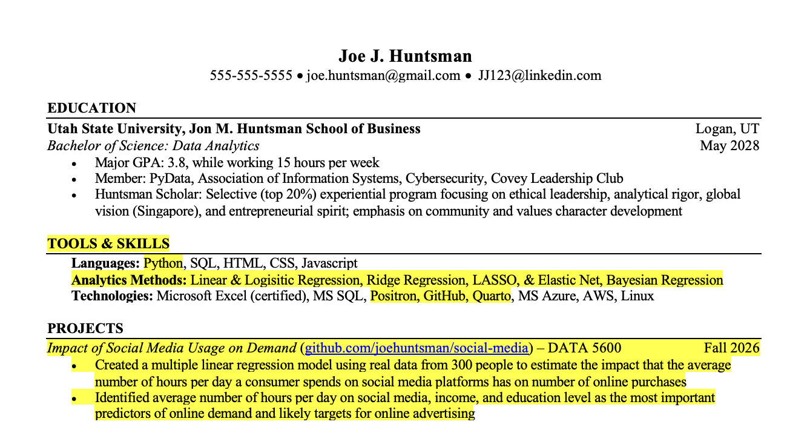
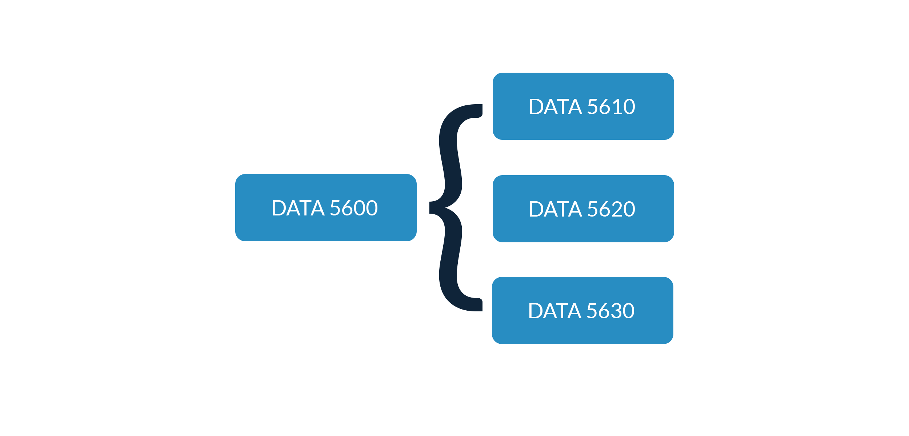

# DATA 5620/6620 Advanced Regression for Causal Inference

- Class: Monday and Wednesday 12:00-1:15 pm, HH 370
- Office Hours: Tuesdays and Thursdays 3-5 pm, GLLB 204 or
  [Zoom](https://usu-edu.zoom.us/j/9087876841?pwd=4Nl9sQnSAk3lXfwblJQduriCrzDYok.1)

This course focuses on the application of regression to inform
decision-making, particularly using interpretable models to understand
the effect of interventions on business outcomes. Students learn to
model experimental and observational data and infer causality instead of
correlation only. Prerequisite: DATA 5600

By the end of this course, you will be able to:

1.  Specify identification strategies for estimating causal effects.
2.  Design effective experiments and apply appropriate methods for
    experimental data.
3.  Model observational data and infer causality using a variety of
    techniques.

## Study and Success

Successful students in this course will demonstrate conceptual
understanding and skill mastery by applying the modeling workflow within
their chosen business context and as part of a group. Each student is an
essential member of a community of learners and should consider the
instructor as both a teacher and a mentor.

Students can focus on learning by using the following study tips:

1.  Prepare for class by studying assigned material and identifying
    questions.
2.  Engage during class by asking questions, taking notes, and actively
    coding.
3.  Apply what you learn in class by working on projects.
4.  Evaluate what you’re learning by reviewing and reflecting on course
    materials.
5.  Reinforce what you’re learning by utilizing office hours and working
    with classmates.

After completing the course, student resumes should reflect the tools,
skills, and methods they have learned and showcase the projects they
have completed. For example:

DATA 5620 Advanced Regression for Causal Inference serves as one of the
courses in the modeling sequence together with DATA 5610 Advanced
Machine Learning for Analytics and DATA 5630 Deep Forecasting.

## Data Stack

Each student will need to bring a laptop, either their own or one rented
from Utah State. While students are welcome to use their preferred
tools, the following [data
stack](https://github.com/marcdotson/data-stack) is recommended and
certain tools are required, as indicated below.

### Python

[Python](https://en.wikipedia.org/wiki/Python_(programming_language)) is
a general purpose, open source programming language developed by
computer scientists. It is the most commonly used programming language
for data wrangling, visualizations, and modeling. See the [data stack
training](https://github.com/marcdotson/data-stack?tab=readme-ov-file#sec-python)
for details on how to best install and manage Python versions and
project environments.

### Positron

A code editor or integrated development environment (IDE), outside of an
open source programming language, is a data analyst’s most important
tool. [Positron](https://positron.posit.co) is a next-generation data
science IDE. Built on VS Code’s [open source
core](https://github.com/microsoft/vscode), Positron combines the
multilingual extensibility of [VS Code](https://code.visualstudio.com/)
with essential data tools common to language-specific IDEs. See the
[data stack
training](https://github.com/marcdotson/data-stack?tab=readme-ov-file#sec-positron)
for a summary of Positron’s data-friendly features.

### GitHub

[GitHub](https://github.com/about) is an online hosting service for
project repositories managed using Git, a powerful [version control
system](https://peerj.com/preprints/3159v2/) and the industry standard
for software development and data projects. Git and GitHub facilitates
collaboration on a single code base and enables students to organize an
online portfolio of work. See the [data stack
training](https://github.com/marcdotson/data-stack?tab=readme-ov-file#sec-github)
for the basics of using Git and GitHub and a [project
template](https://github.com/marcdotson/project-template).

### Quarto

[Quarto](https://quarto.org) is an open source publishing system that
combines text, code, and output. Quarto documents are similar to Jupyter
notebooks, except the content can be rendered into a variety of formats,
including PDFs, Word documents, PowerPoint presentations, Revealjs slide
decks, interactive dashboards, websites, etc. While Quarto is not
required for the course, students will be required to submit code and
output in a PDF format. See the [data stack
training](https://github.com/marcdotson/data-stack?tab=readme-ov-file#sec-quarto)
for more details on Quarto, including how to use Quarto to render a
Jupyter notebook into a PDF.

### Copilot

Students may use their preferred AI to assist in studying and completing
assignments. All students have access to
[Copilot](https://copilot.usu.edu/) through Utah State. However,
students must remember that the objective of this course is learning. AI
can contribute to learning, including helping to debug code and explain
concepts in new ways. AI can also be a detriment to learning, including
when students use AI to think for them. See the [data stack
training](https://github.com/marcdotson/data-stack?tab=readme-ov-file#sec-copilot)
for details on getting access to AI and a discussion on using AI
responsibly.

## Course Materials

### *The Effect*

We will be studying Nick Huntington-Klein’s [*The Effect: An
Introduction to Research Design and
Causality*](https://theeffectbook.net/index.html) (available free
online). He also has a [video
series](https://nickchk.com/theeffectvideos.html) that complements the
book.

## *Program Evaluation for Public Service*

We will be referencing Andrew Heiss’ [Program Evaluation for Public
Service](https://evalsp25.classes.andrewheiss.com) course, which also
includes a [video
series](https://www.youtube.com/playlist?list=PLS6tnpTr39sHcnk9KcoQVzDywxWRzVWHC).

## *Statistical Rethinking*

It may also be helpful to use Richard McElreath’s *Statistical
Rethinking* [video
series](https://github.com/rmcelreath/stat_rethinking_2026) as a
reference when we discuss Bayesian methods.

## Assessment

Assignments are designed to be aligned with what students will be
expected to do in practice. No credit will be given for late work unless
an arrangement is made **prior to the relevant deadline**. Students are
encouraged to review their graded work and ask questions to avoid
repeated mistakes.

Letter grades will follow the standard rubric and will be determined as
follows.

|     |         |     |        |     |        |
|:----|:--------|:----|:-------|:----|:-------|
| A   | 93-100% | B-  | 80-82% | D+  | 67-69% |
| A-  | 90-92%  | C+  | 77-79% | D   | 63-66% |
| B+  | 87-89%  | C   | 73-76% | D-  | 60-62% |
| B   | 83-86%  | C-  | 70-72% | E   | 0-59%  |

### Participation (20%)

This class is all about participation. If students aren’t attending,
they can’t contribute. Students will take turns preparing slides and
presenting to lead the discussion in class. When relevant, students
should include relevant code when leading the discussion.

### Interviews (30%)

Interviews are an opportunity for students to demonstrate their personal
understanding and prepare for future real-world job interviews. Designed
to complement group project work, interviews will include questions
about course concepts, project work (including code), and reflections on
performance in the course.

Interviews with the instructor will occur at the beginning, middle, and
end of the semester during office hours or by appointment.

### Projects (50%)

Projects are the focus of learning by doing in the course, serving as
the means for students to apply their conceptual understanding and skill
mastery both as a group and within their business domain of interest.
Students will complete two group projects, one focused on experimental
data and one focused on observational data. The groups will both present
and submit a report.

The week before the presentations, groups will submit a draft of their
slides to get feedback and have time for revision. The other students in
the class, as well as the group members themselves, will help evaluate
each of the presentations.

## Schedule

Please note that the instructor reserves the right to change the
following schedule at any time and will provide students sufficient
notice as it relates to assignment deadlines.

### Week 01

- Causal Inference (Marc)
- Modeling Workflow (Marc)
- Ch. 1-2 of *The Effect*
- *Statistical Rethinking 2026* [Lecture A01 Introduction to Bayesian
  Workflow](https://www.youtube.com/watch?v=ztbYkBPDOgU&t=96s)
- Milestone 01: Brainstorm Project Ideas

### Week 02

- Decisions and Data (Marc)
- Probability and Statistics (Marc)
- Ch. 3-4 of *The Effect*
- *Statistical Rethinking 2026* [Lecture A02 Garden of Forking
  Data](https://www.youtube.com/watch?v=pGVkCWlXnlg)
- Milestone 02: Narrate a Data Story

### Week 03

- Identification and DAGs (Gabby)
- Ch. 5-7 of *The Effect*
- *Statistical Rethinking 2026* [Lecture A03 Geocentric
  Models](https://www.youtube.com/watch?v=JX_UyidsQNg)
- Milestone 03: Specify a DAG

### Week 04

- Causal Paths and Controls (Tate)
- Sports and Marketing Analytics Presentation
- Ch. 8 of *The Effect*
- *Statistical Rethinking 2023* [Elemental
  Confounds](https://www.youtube.com/watch?v=mBEA7PKDmiY&list=PLDcUM9US4XdPz-KxHM4XHt7uUVGWWVSus&index=6)
  and [Good and Bad
  Controls](https://www.youtube.com/watch?v=uanZZLlzKHw&list=PLDcUM9US4XdPz-KxHM4XHt7uUVGWWVSus&index=7)
- Milestone 04: Specify an Identification Strategy

### Week 05

- Potential Outcomes and Experimental Control (Marc)
- Discrete Choice Analysis (Aleks)
- Ch. 9-11 of *The Effect*
- Milestone 05: Run a Conjoint Experiment

### Week 06

- Multilevel Models (Marc)
- Introduction to PyMC (?)
- Milestone 06: Prepare a Presentation

### Week 07

- Presentations

### Week 08

- Regression (?)
- Ch. 12-13 of *The Effect*

### Week 09

- Matching (?)
- Ch. 14 of *The Effect*

### Week 10

- Spring Break

### Week 11

- Simulation (?)
- Ch. 15 of *The Effect*

### Week 12

- Fixed Effects (?)
- Ch. 16 of *The Effect*

### Week 13

- Event Studies (?)
- Ch. 17 of *The Effect*

### Week 14

- Difference-in-Differences (?)
- Ch. 18 of *The Effect*

### Week 15

- Presentations
