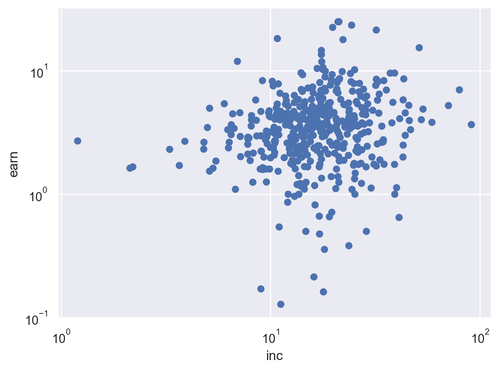

# Probability and Statistics


- Connect Bayesian inference with causality
- Probability as a unifying framework (*The Effect* p. 19)
- Referencing “marginal” distributions as being “unconditional”
  distributions (*The Effect* p. 47)
- Connecting an interest in theoretical distributions to sampling
  distributions in frequentist inference (*The Effect* p. 36)
- Connecting “the truth” conditioned on the model we’ve specified (*The
  Effect* p. 36)
- Frequentist inference as using data to “claw our way back” to the
  sampling distribution (*The Effect* p. 37)
- Focus on OLS as an economist, use the “regression” Fred Armisen meme

Note that it’s not possible to [specify the file path for figures
rendered using
Python](https://github.com/orgs/quarto-dev/discussions/12056) but that
this won’t be an issue when converting these outlines into reveal.js
slides thanks to `format: revealjs: embed-resources: true`.

``` python
import pandas as pd
import numpy as np
import statsmodels.formula.api as smf
import seaborn as sns
import seaborn.objects as so
from causaldata import Mroz

# Read in data
dt = Mroz.load_pandas().data

# Keep just working women
dt = dt.query('lfp == True')

# Create unlogged earnings
dt = dt.assign(earn = lambda x: np.exp(x['lwg']))

# 1. Draw a scatterplot 
(so.Plot(dt, x = 'inc', y = 'earn')
  .add(so.Dot()).scale(x = 'log', y = 'log')
)
```



``` python
# 2. Get the conditional mean by college attendance
# wc is the college variable
dt.groupby('wc').agg({'earn': 'mean'})
```

<div>
<style scoped>
    .dataframe tbody tr th:only-of-type {
        vertical-align: middle;
    }
&#10;    .dataframe tbody tr th {
        vertical-align: top;
    }
&#10;    .dataframe thead th {
        text-align: right;
    }
</style>

|       | earn     |
|-------|----------|
| wc    |          |
| False | 3.583539 |
| True  | 5.349448 |

</div>

``` python
# 3. Get the conditional mean by bins
# Use cut to get 10 bins
dt = dt.assign(inc_bin = lambda x: pd.cut(x['inc'],10))
dt.groupby('inc_bin').agg({'earn': 'mean'})
```

    /var/folders/91/9dt638d97411wn5mrksvb38h0000gp/T/ipykernel_50189/2769554712.py:4: FutureWarning: The default of observed=False is deprecated and will be changed to True in a future version of pandas. Pass observed=False to retain current behavior or observed=True to adopt the future default and silence this warning.
      dt.groupby('inc_bin').agg({'earn': 'mean'})

<div>
<style scoped>
    .dataframe tbody tr th:only-of-type {
        vertical-align: middle;
    }
&#10;    .dataframe tbody tr th {
        vertical-align: top;
    }
&#10;    .dataframe thead th {
        text-align: right;
    }
</style>

|                   | earn     |
|-------------------|----------|
| inc_bin           |          |
| (-0.12, 9.074\]   | 3.091594 |
| (9.074, 18.177\]  | 3.826430 |
| (18.177, 27.28\]  | 4.954454 |
| (27.28, 36.383\]  | 4.563332 |
| (36.383, 45.485\] | 4.241790 |
| (45.485, 54.588\] | 6.139739 |
| (54.588, 63.691\] | 3.825000 |
| (63.691, 72.794\] | 5.232558 |
| (72.794, 81.897\] | 7.015306 |
| (81.897, 91.0\]   | 3.666667 |

</div>

``` python
# 4. Draw the LOESS and linear regression curves
# Do log beforehand for these axes
dt = dt.assign(linc = lambda x: np.log(x['inc']))
sns.regplot(x = 'linc', y = 'lwg', data = dt, lowess = True, ci = None)
```

    /Users/a00714634/Documents/02_data_5620:6620/data-5620-6620/.venv/lib/python3.13/site-packages/pandas/core/arraylike.py:399: RuntimeWarning: invalid value encountered in log
      result = getattr(ufunc, method)(*inputs, **kwargs)


``` python
# 5. Run a linear regression, by itself and including controls
m1 = smf.ols(formula = 'lwg ~ linc', data = dt).fit()
print(m1.summary())
```

                                OLS Regression Results                            
    ==============================================================================
    Dep. Variable:                    lwg   R-squared:                       0.027
    Model:                            OLS   Adj. R-squared:                  0.024
    Method:                 Least Squares   F-statistic:                     11.65
    Date:                Wed, 21 Jan 2026   Prob (F-statistic):           0.000703
    Time:                        11:13:34   Log-Likelihood:                -461.34
    No. Observations:                 427   AIC:                             926.7
    Df Residuals:                     425   BIC:                             934.8
    Df Model:                           1                                         
    Covariance Type:            nonrobust                                         
    ==============================================================================
                     coef    std err          t      P>|t|      [0.025      0.975]
    ------------------------------------------------------------------------------
    Intercept      0.5690      0.185      3.079      0.002       0.206       0.932
    linc           0.2207      0.065      3.413      0.001       0.094       0.348
    ==============================================================================
    Omnibus:                       65.243   Durbin-Watson:                   1.947
    Prob(Omnibus):                  0.000   Jarque-Bera (JB):              163.890
    Skew:                          -0.761   Prob(JB):                     2.58e-36
    Kurtosis:                       5.626   Cond. No.                         17.1
    ==============================================================================

    Notes:
    [1] Standard Errors assume that the covariance matrix of the errors is correctly specified.

``` python
# k5 is number of kids under 5 in the house
m2 = smf.ols(formula = 'lwg ~ linc + wc + k5', data = dt).fit()
print(m2.summary())
```

                                OLS Regression Results                            
    ==============================================================================
    Dep. Variable:                    lwg   R-squared:                       0.070
    Model:                            OLS   Adj. R-squared:                  0.064
    Method:                 Least Squares   F-statistic:                     10.67
    Date:                Wed, 21 Jan 2026   Prob (F-statistic):           8.92e-07
    Time:                        11:13:34   Log-Likelihood:                -451.54
    No. Observations:                 427   AIC:                             911.1
    Df Residuals:                     423   BIC:                             927.3
    Df Model:                           3                                         
    Covariance Type:            nonrobust                                         
    ==============================================================================
                     coef    std err          t      P>|t|      [0.025      0.975]
    ------------------------------------------------------------------------------
    Intercept      0.7065      0.184      3.833      0.000       0.344       1.069
    wc[T.True]     0.3353      0.075      4.450      0.000       0.187       0.483
    linc           0.1351      0.066      2.041      0.042       0.005       0.265
    k5            -0.0675      0.087     -0.775      0.439      -0.239       0.104
    ==============================================================================
    Omnibus:                       82.950   Durbin-Watson:                   2.001
    Prob(Omnibus):                  0.000   Jarque-Bera (JB):              253.726
    Skew:                          -0.889   Prob(JB):                     8.02e-56
    Kurtosis:                       6.332   Cond. No.                         17.6
    ==============================================================================

    Notes:
    [1] Standard Errors assume that the covariance matrix of the errors is correctly specified.
